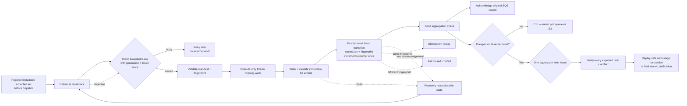
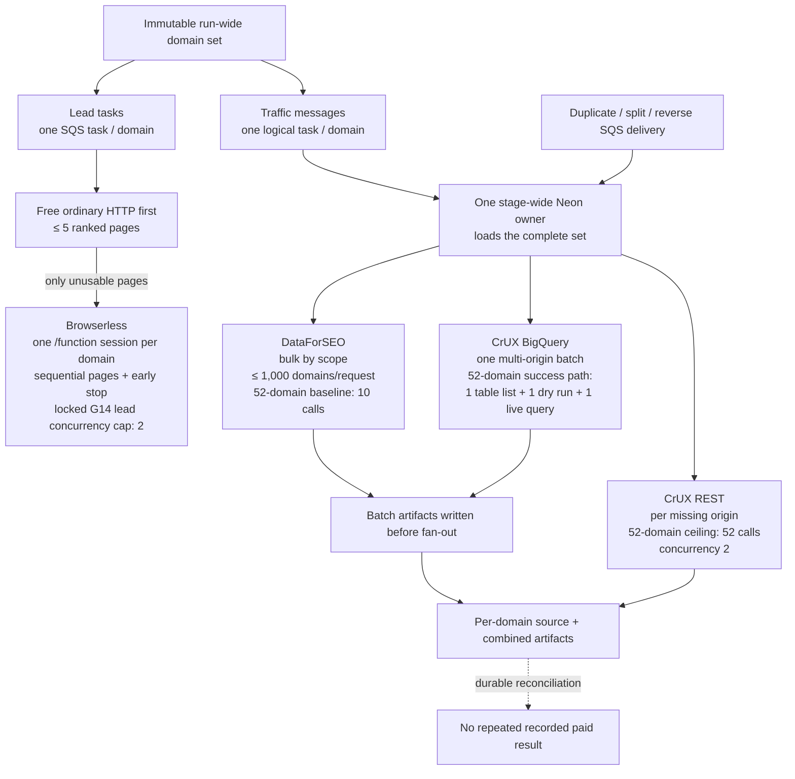
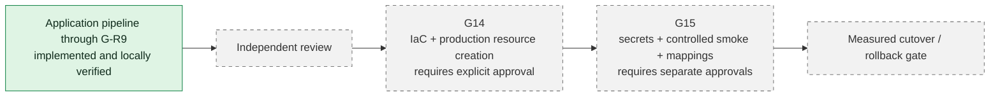

# Implemented AWS Pipeline Architecture

> Implemented and verified locally through **G-R9**. AWS infrastructure, deployment, live-provider smoke tests, and cutover remain behind **G14/G15**.

```mermaid
flowchart TB
    subgraph CONTROL["Existing control plane — unchanged"]
        USER["User / frontend"]
        API["Existing authenticated API"]
        PLAN["Generate + probe queries"]
        REVIEW["Editable review<br/>revision checks<br/>explicit confirmation"]
        DISPATCH["Confirmed-query dispatcher<br/>validate frozen provider config"]
        USER --> API --> PLAN --> REVIEW --> DISPATCH
    end

    subgraph DISCOVERY["1 — Discovery"]
        QM[("S3<br/>confirmed-query-manifest-v1")]
        DREG[("Neon<br/>immutable discovery stage<br/>expected RunQuery IDs")]
        DQ[["Discovery SQS<br/>1 message / confirmed RunQuery"]]
        L1["Lambda 1<br/>Discovery worker<br/>consume durable probe result<br/>0 Google / 0 Browserless"]
        QA[("S3<br/>queries/{queryId}/domains.json<br/>terminal query artifact")]
        DT[("Neon<br/>fenced, idempotent<br/>query terminal record")]
        DCQ[["Domain-aggregation check SQS"]]
        DG{"terminalCount = expectedCount?"}
        L2["Lambda 2<br/>Domain aggregator<br/>single 120 s fenced owner"]

        DISPATCH -->|"write first"| QM
        DISPATCH -->|"register complete expected set"| DREG
        DREG --> DQ --> L1
        QM --> L1
        L1 -->|"validate + immutable write"| QA
        QA --> DT --> DCQ --> DG
        DREG -. "zero expected" .-> DCQ
        DG -->|"No — exit without polling"| DWAIT["Later terminal/recovery<br/>sends another check"]
        DG -->|"Yes — conditional claim"| L2
        DREG --> L2
        QA --> L2
    end

    subgraph DOMAIN["2 — Domain reconciliation and immutable work plan"]
        MERGE["Validate every expected artifact<br/>merge + deduplicate by existing stable shop identity<br/>retain query/category provenance"]
        REUSE[("Neon bounded reuse reads<br/>identity + scope + metric set<br/>contract + freshness/latest month")]
        FLAGS["Per-domain frozen decisions<br/>needsLead<br/>needsTraffic<br/>needsCruxRest<br/>needsCruxBigQuery"]
        CA[("S3<br/>domains/{shopId}/candidate.json")]
        DM[("S3<br/>domains-manifest.json<br/>domain manifest + complete work plan")]
        DCP[("Neon transaction<br/>Shop + RunStore checkpoint<br/>register complete lead stage")]
        LQ[["Lead SQS<br/>1 message / needsLead domain"]]
        LCQ[["Lead-aggregation check SQS"]]

        L2 --> MERGE --> REUSE --> FLAGS
        FLAGS --> CA
        FLAGS --> DM
        DM --> DCP
        CA --> DCP
        DCP --> LQ
        DCP -. "zero tasks / all reusable" .-> LCQ
    end

    subgraph LEAD["3 — Lead enrichment and private checkpoint"]
        L3["Lambda 3<br/>Lead worker<br/>1 stable domain<br/>task lease 60 s"]
        HTTP["Homepage + bounded sitemap discovery<br/>rank ≤ 5 same-store pages<br/>ordinary HTTP first"]
        NEED_RENDER{"Failed or unusable pages?"}
        BA[("S3 immutable<br/>Browserless attempt marker")]
        BL["Browserless /function<br/>one sequential domain session<br/>≤ 5 pages · 8 s navigation<br/>45 s session · early stop<br/>primary/fallback sequential"]
        AIQ{"AI normalization enabled?"}
        AIA[("S3 immutable<br/>AI attempt marker")]
        AI["OpenAI normalization<br/>≤ 1 request / domain"]
        EXTRACT["Deterministic extraction + validation<br/>qualified / rejected / safe failed"]
        LA[("S3<br/>domains/{shopId}/lead.json<br/>terminal lead artifact")]
        LT[("Neon<br/>fenced, idempotent<br/>lead terminal record")]
        LG{"terminalCount = expectedCount?"}
        L4["Lambda 4<br/>Lead aggregator<br/>single 120 s fenced owner"]
        LVERIFY["Validate all new, reused,<br/>rejected and failed outcomes"]
        PRIVATE[("Neon atomic private checkpoint<br/>RunStore + run-specific Lead + diagnostics<br/>resultsAvailable = false<br/>no new profile/grant visibility")]
        TREG[("Neon<br/>derive qualified domains<br/>register complete traffic_crux stage")]
        TQ[["Traffic SQS<br/>1 trigger / eligible domain"]]
        FCQ[["Final-aggregation check SQS"]]

        LQ --> L3
        DM --> L3
        CA --> L3
        L3 --> HTTP --> NEED_RENDER
        NEED_RENDER -->|"No"| EXTRACT
        NEED_RENDER -->|"Yes — write before call"| BA --> BL --> EXTRACT
        EXTRACT --> AIQ
        AIQ -->|"No"| LA
        AIQ -->|"Yes — write before call"| AIA --> AI --> LA
        LA --> LT --> LCQ --> LG
        LG -->|"No — exit"| LWAIT["Later terminal/recovery<br/>sends another check"]
        LG -->|"Yes — conditional claim"| L4
        DM --> L4
        LA --> L4
        L4 --> LVERIFY --> PRIVATE --> TREG
        TREG --> TQ
        TREG -. "zero tasks / all reused" .-> FCQ
    end

    subgraph TRAFFIC["4 — Stage-wide traffic execution with per-domain results"]
        L5["Lambda 5<br/>Combined traffic worker<br/>SQS records are triggers only"]
        OWNER{"Acquire one Neon Run lease?"}
        BUSY["No provider work<br/>return busy/retryable"]
        LOAD["Load complete registered task set<br/>+ immutable work plan<br/>+ qualified persisted leads"]

        DFS_LEDGER[("Neon DataForSEO ledger<br/>reserve cost + fence ambiguity")]
        DFS["DataForSEO bulk<br/>1 request / configured scope<br/>≤ 1,000 domains per request"]
        DFS_BATCH[("S3 immutable<br/>per-scope batch result")]

        REST_ATTEMPT[("S3 immutable<br/>CrUX REST attempt / origin")]
        REST["CrUX REST<br/>1 missing origin / adapter call<br/>concurrency ≤ 2"]

        BQ_ATTEMPT[("S3 immutable<br/>BigQuery attempt<br/>month + accepted bytes + stable request ID")]
        BQ["CrUX BigQuery batch<br/>latest table → dry run → live query<br/>≤ 1,000 origins + byte cap"]
        BQ_BATCH[("S3 immutable<br/>BigQuery batch result")]

        SOURCE[("S3 per-domain source artifacts<br/>dataforseo · crux-rest · crux-bigquery")]
        COMBINE["Combine independent component states<br/>available · partial · no_coverage<br/>unavailable · ambiguous<br/>contract_mismatch · reused · skipped"]
        TA[("S3<br/>domains/{shopId}/traffic-crux.json<br/>one combined terminal artifact / domain")]
        TT[("Neon<br/>fenced, idempotent<br/>traffic_crux terminal records")]
        TG{"terminalCount = expectedCount?"}

        TQ --> L5 --> OWNER
        OWNER -->|"No"| BUSY
        OWNER -->|"Yes"| LOAD
        DM --> LOAD
        PRIVATE --> LOAD

        LOAD --> DFS_LEDGER --> DFS --> DFS_BATCH --> SOURCE
        LOAD --> REST_ATTEMPT --> REST --> SOURCE
        LOAD --> BQ_ATTEMPT --> BQ --> BQ_BATCH --> SOURCE
        SOURCE --> COMBINE --> TA --> TT --> FCQ --> TG
        TG -->|"No — exit"| TWAIT["Later terminal/recovery<br/>sends another check"]
    end

    subgraph PUBLICATION["5 — Atomic final publication"]
        L6["Lambda 6<br/>Final aggregator<br/>single 120 s fenced owner"]
        FVERIFY["Validate every expected task<br/>combined artifact + source artifact<br/>batch evidence + reuse evidence"]
        TX[("One Neon transaction<br/>lock paid ledgers<br/>publish profiles + owner grants<br/>persist traffic + both CrUX sources<br/>score v3 + summaries<br/>complete stages and Run<br/>resultsAvailable = true LAST")]
        READ["Existing owner-scoped APIs<br/>history · results · master leads<br/>traffic · CSV · frontend"]

        TG -->|"Yes — conditional claim"| L6
        DM --> L6
        TA --> L6
        SOURCE --> L6
        DFS_BATCH --> L6
        BQ_BATCH --> L6
        LA --> L6
        L6 --> FVERIFY --> TX --> READ --> API
    end

    subgraph RECOVERY["7 — Recovery, retry and cancellation"]
        CLOCK["Scheduled/manual trigger"]
        L7["Lambda 7<br/>Recovery worker<br/>bounded scan ≤ 100"]
        SCAN[("Neon<br/>expired known tasks/stages<br/>stale DataForSEO in-flight → ambiguous")]
        REQUEUE["Recreate exact versioned message<br/>from durable stage/task identity"]
        CANCEL["Operator/internal cancellation"]
        FENCE[("Neon atomic generation cancellation<br/>terminalize nonterminal work<br/>invalidate late lease tokens")]

        CLOCK --> L7 --> SCAN --> REQUEUE
        REQUEUE -. "work retry" .-> DQ
        REQUEUE -. "work retry" .-> LQ
        REQUEUE -. "work retry" .-> TQ
        REQUEUE -. "aggregation retry" .-> DCQ
        REQUEUE -. "aggregation retry" .-> LCQ
        REQUEUE -. "aggregation retry" .-> FCQ
        CANCEL --> FENCE
        FENCE -. "late writes rejected" .-> DT
        FENCE -. "late writes rejected" .-> LT
        FENCE -. "late writes rejected" .-> TT
        FENCE -. "publication rejected" .-> TX
    end

    DLQ["G14 queue configuration<br/>at-least-once delivery · partial batch failure<br/>bounded receives → dedicated DLQ"]
    DQ -.-> DLQ
    DCQ -.-> DLQ
    LQ -.-> DLQ
    LCQ -.-> DLQ
    TQ -.-> DLQ
    FCQ -.-> DLQ

    classDef neon fill:#dff4e4,stroke:#18864b,color:#102b1c;
    classDef s3 fill:#fff0cf,stroke:#b66d00,color:#3e2900;
    classDef queue fill:#e7edff,stroke:#4263c6,color:#14275e;
    classDef lambda fill:#f6e7ff,stroke:#8b42b8,color:#351345;
    classDef gate fill:#ffe3e3,stroke:#c43d3d,color:#4d1212;
    class DREG,DT,DCP,REUSE,LT,PRIVATE,TREG,DFS_LEDGER,TT,TX,SCAN,FENCE neon;
    class QM,QA,CA,DM,BA,AIA,LA,DFS_BATCH,REST_ATTEMPT,BQ_ATTEMPT,BQ_BATCH,SOURCE,TA s3;
    class DQ,DCQ,LQ,LCQ,TQ,FCQ queue;
    class L1,L2,L3,L4,L5,L6,L7 lambda;
    class DG,LG,TG,OWNER,NEED_RENDER,AIQ gate;
```

## Durable stage protocol

## Cost and fan-out shape

## Deployment boundary

**Authority:** Neon proves completion and visibility; S3 stores private immutable artifacts; SQS delivers work; Lambda executes bounded steps. Queue emptiness, S3 object counts, and S3 events never advance a stage.
