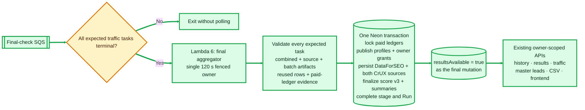
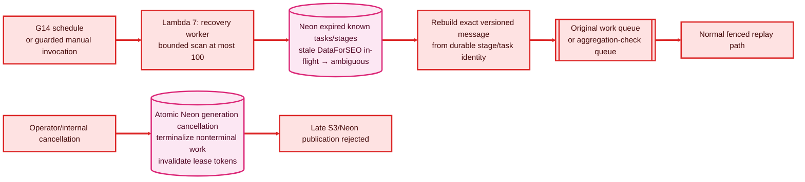
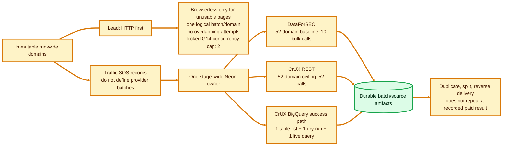
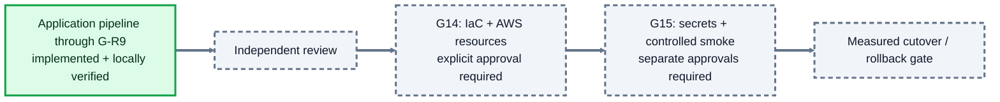

# Implemented AWS Pipeline Architecture

> Faithful to the locally verified **G-R9** implementation. Grey deployment items remain parked behind **G14/G15**.

## End-to-end snake

```mermaid
%%{init: {"theme":"base","themeVariables":{"fontFamily":"Inter, Arial, sans-serif","fontSize":"19px","lineColor":"#475569"},"flowchart":{"curve":"basis","nodeSpacing":55,"rankSpacing":70,"htmlLabels":true}}}%%
flowchart TB
    subgraph ROW1[" "]
        direction LR
        A["Existing frontend + API<br/>query generation and probes"]
        B["Editable review<br/>revision check + confirmation"]
        C["S3 query manifest<br/>Neon discovery registration"]
        D["Discovery SQS<br/>Lambda 1: query worker"]
        A --> B --> C --> D
    end

    D --> E

    subgraph ROW2[" "]
        direction RL
        E["Lambda 2<br/>domain aggregator"]
        F["S3 domain manifest<br/>frozen work plan"]
        G["Neon lead registration<br/>Lead SQS"]
        H["Lambda 3<br/>lead worker per domain"]
        E --> F --> G --> H
    end

    H --> I

    subgraph ROW3[" "]
        direction LR
        I["Lambda 4<br/>lead aggregator"]
        J["Private Neon lead checkpoint<br/>resultsAvailable = false"]
        K["Neon traffic registration<br/>Traffic SQS triggers"]
        L["Lambda 5<br/>stage-wide traffic worker"]
        I --> J --> K --> L
    end

    L --> M

    subgraph ROW4[" "]
        direction RL
        M["Per-domain S3 traffic artifacts<br/>Neon terminal records"]
        N["Lambda 6<br/>final aggregator"]
        O["Atomic Neon publication<br/>resultsAvailable = true"]
        P["Existing history, results,<br/>traffic, CSV and frontend"]
        M --> N --> O --> P
    end

    classDef control fill:#f1f5f9,stroke:#475569,stroke-width:3px,color:#0f172a;
    classDef discovery fill:#dbeafe,stroke:#2563eb,stroke-width:3px,color:#172554;
    classDef lead fill:#ede9fe,stroke:#7c3aed,stroke-width:3px,color:#2e1065;
    classDef traffic fill:#ffedd5,stroke:#ea580c,stroke-width:3px,color:#431407;
    classDef final fill:#dcfce7,stroke:#16a34a,stroke-width:3px,color:#052e16;
    class A,B control;
    class C,D,E discovery;
    class F,G,H,I,J lead;
    class K,L,M traffic;
    class N,O,P final;

    linkStyle 0,1 stroke:#475569,stroke-width:4px;
    linkStyle 2,3,4 stroke:#2563eb,stroke-width:4px;
    linkStyle 5,6,7,8 stroke:#7c3aed,stroke-width:4px;
    linkStyle 9,10,11,12 stroke:#ea580c,stroke-width:4px;
    linkStyle 13,14 stroke:#16a34a,stroke-width:4px;
```

## 1. Confirmation, discovery and domain planning

```mermaid
%%{init: {"theme":"base","themeVariables":{"fontFamily":"Inter, Arial, sans-serif","fontSize":"18px"},"flowchart":{"curve":"basis","nodeSpacing":45,"rankSpacing":55,"htmlLabels":true}}}%%
flowchart LR
    A["Confirmed revision<br/>durable accepted probe results"]
    B[("S3<br/>confirmed-query-manifest-v1")]
    C[("Neon<br/>immutable expected RunQuery set")]
    D[["Discovery SQS<br/>one message per RunQuery ID"]]
    E["Lambda 1: discovery worker<br/>60 s fenced task lease<br/>bounded HTTP identity resolution<br/>zero Google / Browserless"]
    F[("S3<br/>queries/{queryId}/domains.json")]
    G[("Neon terminal task<br/>artifact key + fingerprint")]
    H[["Domain-check SQS"]]
    I{"All expected<br/>tasks terminal?"}
    J["Exit without polling"]
    K["Lambda 2: domain aggregator<br/>single 120 s fenced owner"]
    L["Validate all query artifacts<br/>merge stable shop identity<br/>retain every provenance occurrence"]
    M[("Neon reuse reads<br/>identity + scope + metric set<br/>contract + freshness/latest month")]
    N[("S3 candidate artifacts<br/>+ domains-manifest.json<br/>+ immutable work plan")]
    O[("Neon transaction<br/>Shop / RunStore checkpoint<br/>complete lead task set")]
    P[["Lead SQS<br/>only needsLead domains"]]

    A --> B --> C --> D --> E --> F --> G --> H --> I
    I -->|"No"| J
    I -->|"Yes: conditional claim"| K --> L --> M --> N --> O --> P
    C -. "expectedCount = 0" .-> H

    classDef box fill:#dbeafe,stroke:#2563eb,stroke-width:3px,color:#172554;
    classDef store fill:#e0f2fe,stroke:#0369a1,stroke-width:3px,color:#082f49;
    classDef decision fill:#fef3c7,stroke:#d97706,stroke-width:3px,color:#451a03;
    class A,D,E,H,J,K,L,P box;
    class B,C,F,G,M,N,O store;
    class I decision;
    linkStyle default stroke:#2563eb,stroke-width:4px;
```

## 2. Lead enrichment and private checkpoint

```mermaid
%%{init: {"theme":"base","themeVariables":{"fontFamily":"Inter, Arial, sans-serif","fontSize":"18px"},"flowchart":{"curve":"basis","nodeSpacing":45,"rankSpacing":55,"htmlLabels":true}}}%%
flowchart LR
    A[["Lead SQS<br/>one stable domain"]]
    B["Lambda 3: lead worker<br/>60 s fenced task + ShopWork owner"]
    C["Homepage + bounded sitemap<br/>rank at most 5 same-store pages"]
    D["Ordinary HTTP first"]
    E{"Any response failed<br/>or unusable?"}
    F["Use ordinary documents"]
    G[("S3 Browserless<br/>attempt marker before call")]
    H["Browserless /function<br/>one logical domain batch<br/>sequential pages + early stop<br/>8 s navigation / 45 s attempt"]
    I["One non-overlapping fallback<br/>only after 401 / 403 / 429"]
    J["Extract + validate evidence"]
    K{"AI normalization<br/>enabled and required?"}
    L[("S3 AI attempt marker<br/>prevents repeated call")]
    M["OpenAI normalization<br/>at most one request"]
    N[("S3 lead.json<br/>qualified / rejected / safe failed")]
    O[("Neon terminal lead task")]
    P[["Lead-check SQS"]]
    Q{"All lead tasks terminal?"}
    W["Exit without polling<br/>later terminal/recovery sends a new check"]
    R["Lambda 4: lead aggregator<br/>validate new + reused + failed outcomes"]
    S[("Atomic private Neon checkpoint<br/>RunStore + run-specific Lead + diagnostics<br/>no new profile/grant visibility<br/>resultsAvailable = false")]
    T[("Register qualified traffic task set")]

    A --> B --> C --> D --> E
    E -->|"No"| F --> J
    E -->|"Yes"| G --> H --> I --> J
    J --> K
    K -->|"No"| N
    K -->|"Yes"| L --> M --> N
    N --> O --> P --> Q
    Q -->|"Not ready"| W
    Q -->|"Ready: one owner"| R --> S --> T

    classDef worker fill:#ede9fe,stroke:#7c3aed,stroke-width:3px,color:#2e1065;
    classDef store fill:#f3e8ff,stroke:#9333ea,stroke-width:3px,color:#3b0764;
    classDef decision fill:#fef3c7,stroke:#d97706,stroke-width:3px,color:#451a03;
    class A,B,C,D,F,H,I,J,M,P,R,W worker;
    class G,L,N,O,S,T store;
    class E,K,Q decision;
    linkStyle default stroke:#7c3aed,stroke-width:4px;
```

## 3. Stage-wide traffic batching and per-domain fan-out

```mermaid
%%{init: {"theme":"base","themeVariables":{"fontFamily":"Inter, Arial, sans-serif","fontSize":"18px"},"flowchart":{"curve":"basis","nodeSpacing":55,"rankSpacing":65,"htmlLabels":true}}}%%
flowchart LR
    A[["Traffic SQS<br/>one logical trigger per domain"]]
    B["Lambda 5: combined traffic worker<br/>received records are triggers only"]
    C{"Win the one Neon<br/>Run lease?"}
    D["Busy / retryable<br/>zero provider calls"]
    E[("Load complete registered task set<br/>immutable work plan<br/>qualified persisted leads")]

    subgraph PROVIDERS["One stage-wide owner preserves provider economics"]
        direction TB
        F[("Neon DataForSEO ledger<br/>cost reservation + ambiguity fence")]
        G["DataForSEO bulk chunks<br/>by configured scope<br/>at most 1,000 domains/request"]
        H[("S3 normalized batch result<br/>written before fan-out")]

        I[("S3 CrUX REST attempt<br/>marker per missing origin")]
        J["CrUX REST<br/>one adapter call/origin<br/>concurrency at most 2"]

        K[("S3 BigQuery attempt<br/>month + dry-run bytes<br/>stable request ID + dispatch time")]
        L["CrUX BigQuery<br/>latest table → dry run → live query<br/>one batch up to 1,000 origins<br/>maximum-bytes-billed guard"]
        M[("S3 normalized BigQuery batch result")]

        F --> G --> H
        I --> J
        K --> L --> M
    end

    N[("S3 source artifact per domain<br/>DataForSEO · CrUX REST · CrUX BigQuery")]
    O["Combine independent terminal states<br/>available · partial · no_coverage<br/>unavailable · ambiguous<br/>contract_mismatch · reused · skipped"]
    P[("S3 traffic-crux.json<br/>one combined artifact per domain")]
    Q[("Neon terminal traffic_crux task<br/>artifact key + fingerprint")]
    R[["Final-check SQS"]]

    A --> B --> C
    C -->|"No"| D
    C -->|"Yes"| E
    E --> F
    E --> I
    E --> K
    H --> N
    J --> N
    M --> N
    N --> O --> P --> Q --> R

    classDef worker fill:#ffedd5,stroke:#ea580c,stroke-width:3px,color:#431407;
    classDef store fill:#fef3c7,stroke:#d97706,stroke-width:3px,color:#451a03;
    classDef decision fill:#fee2e2,stroke:#dc2626,stroke-width:3px,color:#450a0a;
    class A,B,D,G,J,L,O,R worker;
    class E,F,H,I,K,M,N,P,Q store;
    class C decision;
    linkStyle default stroke:#ea580c,stroke-width:4px;
```

## 4. Final publication

## 5. Durable commit order

```mermaid
%%{init: {"theme":"base","themeVariables":{"fontFamily":"Inter, Arial, sans-serif","fontSize":"18px"},"flowchart":{"curve":"basis","nodeSpacing":45,"rankSpacing":55,"htmlLabels":true}}}%%
flowchart LR
    A["Register complete immutable<br/>expected set before dispatch"]
    B["At-least-once SQS delivery"]
    C{"Claim bounded lease<br/>generation + token fence"}
    D["Validate manifest + fingerprint"]
    E["Execute only frozen missing work"]
    F[("Write and validate immutable S3 artifact")]
    G[("First terminal Neon transition<br/>store key + fingerprint<br/>increment counter once")]
    H["Send aggregation check"]
    I["Acknowledge worker message"]
    J{"Complete expected set?"}
    W["Exit without polling<br/>later terminal/recovery redelivers"]
    K["One aggregator verifies<br/>every task and artifact"]
    L["Replay-safe next stage<br/>or atomic final publication"]

    A --> B --> C --> D --> E --> F --> G --> H --> I
    H --> J
    J -->|"No"| W
    J -->|"Yes"| K --> L

    classDef protocol fill:#e0f2fe,stroke:#0284c7,stroke-width:3px,color:#082f49;
    classDef durable fill:#dcfce7,stroke:#16a34a,stroke-width:3px,color:#052e16;
    classDef decision fill:#fef3c7,stroke:#d97706,stroke-width:3px,color:#451a03;
    class A,B,D,E,H,I,K,L,W protocol;
    class F,G durable;
    class C,J decision;
    linkStyle default stroke:#0284c7,stroke-width:4px;
```

## 6. Recovery and cancellation

## 7. Cost-preserving call shape

## Deployment boundary

**Authority:** Neon proves completion and controls visibility. S3 stores private immutable artifacts. SQS delivers at least once. Lambda executes bounded work. Queue emptiness, S3 counts, and S3 events never advance a stage.
